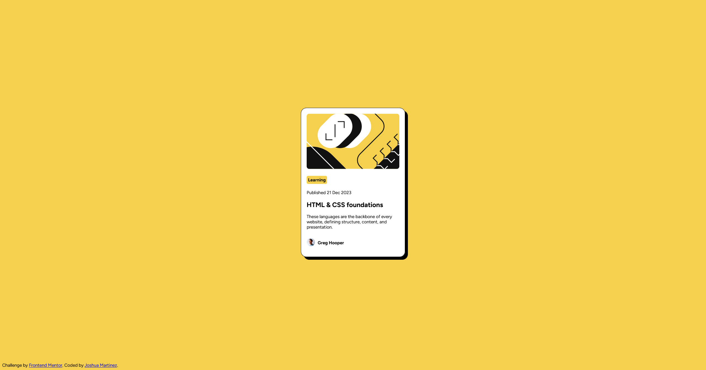

# Frontend Mentor - Blog preview card solution

This is a solution to the [Blog preview card challenge on Frontend Mentor](https://www.frontendmentor.io/challenges/blog-preview-card-ckPaj01IcS). Frontend Mentor challenges help you improve your coding skills by building realistic projects. 

## Table of contents

- [Overview](#overview)
  - [The challenge](#the-challenge)
  - [Screenshot](#screenshot)
  - [Links](#links)
- [My process](#my-process)
  - [Built with](#built-with)
  - [What I learned](#what-i-learned)
  - [Continued development](#continued-development)
  - [Useful resources](#useful-resources)
- [Author](#author)

## Overview

### The challenge

Users should be able to:

- See hover and focus states for all interactive elements on the page

### Screenshot



### Links

- Solution URL: [https://blog-preview-card-gamma-opal.vercel.app/]
- Live Site URL: [https://blog-preview-card-gamma-opal.vercel.app/]

## My process

### Built with

- Semantic HTML5 markup
- CSS custom properties
- Flexbox

### What I learned

```css
* {
      box-sizing: border-box;
    }
.container {
      width: 100%;
      height: 100vh;
      display: flex;
      justify-content: center;
      align-items: center;
      border-style: clear;
    }
ul {
      width: fit-content;
      display: inline-flex;
      margin: 0;
      padding: 0;
      list-style-type: none;
      border-style: clear;
      justify-content: center;
      align-items: center;
    }
```
I practiced different techniques when approaching this project, as to streamline an efficient designing process. I used 'box-sizing: border-box' to ensure the padding & margin do not visually disrupt the already defined width/height of the container I am working with. I learned about 'vh' which stands for 'viewport height' to ensure that the container spans the height of the webpage to allow any divs within it to be properly vertically centered. Another shortcut I practiced when it comes to containers is 'width: fit-content', as I don't have to manually adjust the size of a container to fit the content repeatedly. Instead, I can use this CSS rule followed by a padding CSS rule to improve readability. When it came to using 'display: flex' which is a CSS rule I attempted to use in the past, I did have some issues down the line. It is a new CSS rule I decided to use in this project and it did help make my workflow more efficent. When it came to the 'ul' element, I noticed that the elements in this container were naturally being displayed on new lines even when I used 'display: inline' to off-set this. What I had learned is that I simply needed to override the inheritance from 'display: flex' by adding 'display: inline-flex' within the 'ul' selector. One last issue that led to a learning experience was adjusting the size of the avatar which is positioned at the bottom of the blog post next to the author's name. When I adjusted the size of the avatar icon, it became vertically offset. In order to combat this, I learned that I could simply use 'align-items: center' to bring it back down. The 'display: flex' or rather the flexible box layout allowed me to use various properties to manage the alignment of the content on my webpage more efficiently. 

### Continued development

In future projects I would like to focus on making my webpage more adaptable to various screen sizes. I did not account for different platforms or screen sizes as I am not yet comfortable with those features. I would like to expand upon that, so that I may accurately display my webpage to various users.

### Useful resources

- [W3 Schools](https://www.w3schools.com/css/css3_flexbox.asp) - This article helped me learn about the various properties I could utilize when it comes to the CSS flexbox and how it affects the content on a webapge.

## Author

- Website - [Joshua Martinez](https://blog-preview-card-gamma-opal.vercel.app/)
- Frontend Mentor - [@JoshuaM04](https://www.frontendmentor.io/profile/JoshuaM04)

